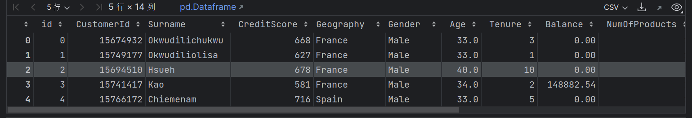
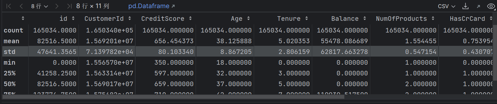
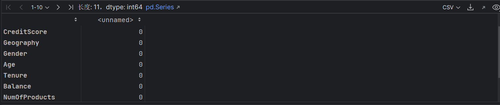
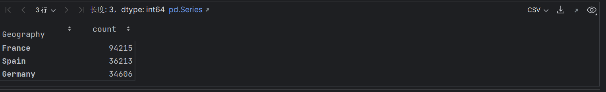
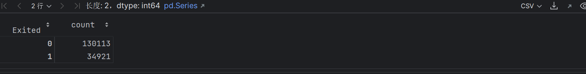

# se401
## kaggle比赛[Binary Classification with a Bank Churn Dataset](https://www.kaggle.com/competitions/playground-series-s4e1)  
### 题目背景  
> Welcome to the 2024 Kaggle Playground Series! Happy New Year! This is the 1st episode of Season 4. We plan to continue in the spirit of previous playgrounds, providing interesting an approachable datasets for our community to practice their machine learning skills, and anticipate a competition each month.
Your Goal: For this Episode of the Series, your task is to predict whether a customer continues with their account or closes it (e.g., churns). Good luck!
The dataset for this competition (both train and test) was generated from a deep learning model trained on the Bank Customer Churn Prediction dataset. Feature distributions are close to, but not exactly the same, as the original. Feel free to use the original dataset as part of this competition, both to explore differences as well as to see whether incorporating the original in training improves model performance.   

### 解读
一个简单的二元分类问题，用来判断银行客户的流失规律,这是[原数据集](https://www.kaggle.com/datasets/shubhammeshram579/bank-customer-churn-prediction),本次比赛所用数据集基于原数据集深度学习生成。我们要利用给到的*train.csv*建立模型，预测*test.csv*中的无标签数据，提交结果为一个csv文件,每一行为*test.csv*的id+预测的结果.二元分类的预测结果一般用0,1表示。
### 开始求解  

#### 初步导包  
```python
import pandas as pd
import matplotlib.pyplot as plt
from sklearn.model_selection import train_test_split
from sklearn.utils import resample
from sklearn.ensemble import RandomForestClassifier
from sklearn.metrics import accuracy_score
```
#### 读入数据  
`pandas`的`read_csv`会将csv文件读入一个`dataframe`（数据帧，数据框）对象,该对象的一些函数可以方便的对数据进行一些操作。
```python
df=pd.read_csv('train.csv')
df.head()
```
`df.head()`可以查看df数据的前几行数据，与此类似的有`df.tail()`


`df.describe()`可以查看数据的一些基本信息

#### 分析  
最后一列的Exited为我们二元分类要进行预测的特征,有两类.,分别用0,1表示，有几列特征为非数值型特征,如`Gender`,`Geography`,需要进行处理,前两列的ID和我们最终要预测的id明显没有什么关联.  
#### 假设  
前两列id 和CustomerId对我们要预测的没有什么关系，可以删除,非数值特征的Surname，即姓氏列对预测也没什么贡献,删除,Gender列和Geography应该都有用，可以映射为数值特征。  
#### 数据预处理  
查看数据有没有缺省：  
```python
df.isnull().sum()
```

对Geography，看到底有哪几个：  
```python
df['Geography'].value_counts()
```


删除特征 ：  
```python
df.drop(['id','CustomerId','Surname'],axis=1,inplace=True)
```
特征转码:  
```python
mapGeography={'France':0,'Spain':1,'Germany':2}
df['Geography']=df['Geography'].map(mapGeography)
mapGender={'Male':0,'Female':1}
df['Gender']=df['Gender'].map(mapGender)
df.head()
```

#### 数据采样与划分
对最后一列的分类情况进行分析:  
```python
df['Exited'].value_counts()
```

可以发现要预测的这一列的分类情况是严重失衡的。  
这有什么影响？

>通常来说在分类任务中，训练数据中某一分类的数量明显高于其他分类，这样会导致的结果是训练的模型在进行预测的时候会倾向于该分类进行预测。这种情况到底好不好？要分情况讨论。例如我们建模的目的是为了更高的准确率，为了在客观世界中出现新的数据时我们能更准确的预测它的所属类别，并且我们用于训练的数据我们能保证是广泛地从客观世界中采样得到，数据中的不平衡分类的分布在客观世界也存在，那么这种倾向对于我们的目的来说是有益的。但设想一下这样的情况，假设某疾病的患病率是1%，我们要建模来检测一些人是否患病，我们的一个极端的思想我们的模型对于每一个来检测的病人，都给出没病的判别。这样的话我们的模型得到了很高的准确率，99%，但造成的后果是灾难性的。在这种情况下我们的目的“更高的准确率”无法评估我们真正的模型效果，我们可以用[代价敏感的评估方法](https://www.cnblogs.com/zhangxianrong/p/14884257.html),而为了抑制这种倾向，我们的的策略可以是1.选择不会产生这种倾向的模型。2.在模型中可以设置参数来让模型训练更关注较少分类的数据，如在sklearn的DecisionTree和RandomForest中设置class_weight参数。3.进行重采样工作，过采样-将较少分类的数据进行复制或者生成，使分类情况均衡,可参考[SMOTE](https://zhuanlan.zhihu.com/p/275744968),或者欠采样-删除被较多分类的数据，参考接下来我的代码。  

为什么在这个任务中我们要抑制这种倾向？
>在kaggle举办的比赛中，二分类的那种，不管给你的带标签的train.csv的标签分类多么不均衡，最终要预测和提交并评估的无标签的test.csv的数据的实际分类情况是55开的，模型对某一类别的倾向会降低我们评估的分数.

进行欠采样  
```python
majority_class = df[df['Exited'] == 0]
minority_class = df[df['Exited'] == 1]
majority_downsampled = resample(majority_class, replace=False, n_samples=len(minority_class), random_state=42)
df = pd.concat([majority_downsampled, minority_class])
df['Exited'].value_counts()
```
最终生成的数据标签列分类已经均衡

接下来进行数据划分：
关于数据划分：
>首先我们需要一部分数据用于训练模型，训练完成后，我们希望有一个办法能够评估模型的好坏，即模型在遇见新数据的时候的表现，有个很自然的想法就是将数据集分为两部分，train和test，其中用train训练模型，用test来检验最终模型的效果来代表模型在遇到新数据时的效果。但是建模不是一笔的买卖，我们需要在建模过程中根据模型的效果来进行一些调参工作，因此在建模时期我们就希望知道模型的效果好不好。假设我们使用的是test数据来检验该效果，我们倾向于在test上得到更高的分数，为此我们会主观不断校准模型，使其在test表现得越来越好，但这种情况下，test的提前参与就让其就失去了代表广泛客观新数据的能力。既然test不行，有一个自然的想法是在train数据中再划分一部分数据来评估效果，我们叫其为验证集。划分验证集的方法通常有留出法，交叉验证法，自助法。前两个最常用。现在一般来说测试集和验证集的界限其实很模糊，而在kaggle中测试集为test.csv不用我们划分，最终评估实际上再在kaggle的打分上完成。为此我们所需要的就是划分训练集和验证集。

```python
X,y=df.drop('Exited',axis=1),df['Exited']
X_train,X_test,y_train,y_test=train_test_split(X,y,test_size=0.2,random_state=42)
```
这里的test实际上是验证集。X是特征，y是我们要预测的标签，利用`sklearn`的`train_test_split`进行随机划分，其中验证集留了20%的数据.

#### 建模求解  
一般分类回归之类的任务可以用一用万能的随机森林模型.  
```python
#初始化模型
rf=RandomForestClassifier(n_estimators=400,max_depth=None,random_state=42)
#训练
rf.fit(X_train,y_train)
```
#### 评估

```python
y_train_pred=rf.predict(X_train)
y_test_pred=rf.predict(X_test)
print('Train Accuracy: ',accuracy_score(y_train,y_train_pred))
print('Test Accuracy: ',accuracy_score(y_test,y_test_pred))
```
得到
```
Train Accuracy:  0.9998210226764269
Test Accuracy:  0.7963347412126852

```
明显的过拟合，可以回头调参换模型加正则化项之类。


#### 生成用于提交的csv文件
```python
df_submission=pd.read_csv('test.csv')
id_submission=df_submission['id']
df_submission.drop(['id','CustomerId','Surname'],axis=1,inplace=True)
df_submission['Geography']=df_submission['Geography'].map(mapGeography)
df_submission['Gender']=df_submission['Gender'].map(mapGender)
y_pred=rf.predict(df_submission)
submission=pd.DataFrame({'id':id_submission,'Exited':y_pred})
submission.to_csv('submission.csv',index=False)
```
kaggle提交要求一列id加上一列预测。test.csv的数据是完整的除标签数据.

结果:


#### 后续

可以进行更精细的数据预处理和特征工程来尝试提高分数。
